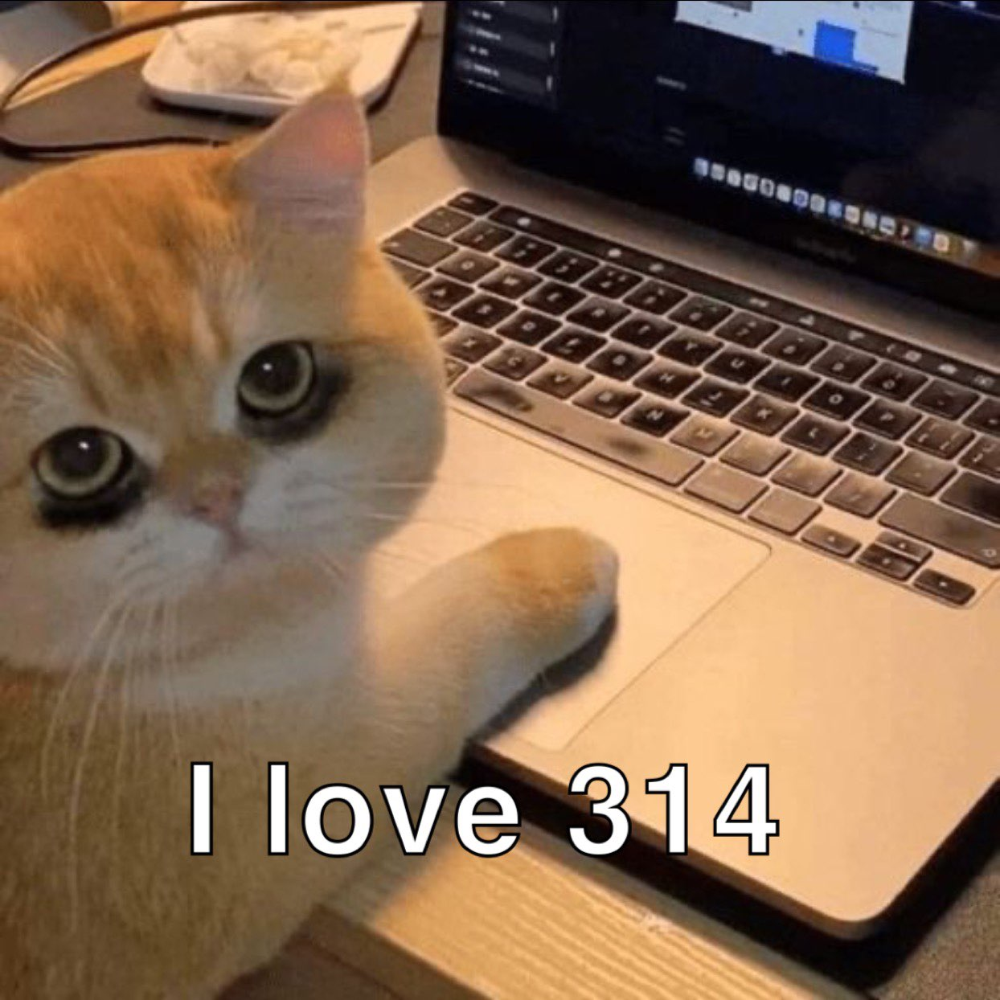

## Into the Fray

Similar to mastering any other language, delving into Javascript after not coding for a while, was like climbing an endless wall. At times you might've felt like you've grasped everything, only to realize you've barely scratched the surface, and forgot a semicolon. Entering this class with some prior but limited experience, I wouldn't quite consider myself a pro, but just good enough to get the job done. Using JavaScript, the difference is like night and day compared to the others. The simplicity and syntax of this language are incredibly beneficial for newbie coders as well as for those of us who might be a bit rusted, such as myself. I revisited and discovered several crucial concepts that are valuable not only for mastering this language but also for personal growth.  JavaScript is among the popular computer languages, people flock to when first starting out their coding journey, and there is a reason why this language is one of the best. It's simply great.

## Real WO(rl)D Conditions

I found the practice WODs to be extremely beneficial. It definitely provided me with a wake-up call and set my rusted gears into motion. Performing under pressure truly showcases what one can do with their knowledge. While it's true the all-or-nothing grading on the WOD  is definitely daunting, I do love myself a challenge. As we go progress through this semester, I find it truly valuable that we are getting hands-on experience with real-world conditions. This exposure not only boosts our confidence but also highlights our individual strengths and areas for improvement.

