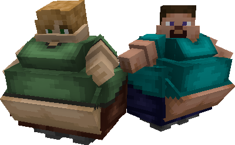

## What?....

In the realm of software development, design patterns serve as the unseen architects, quietly shaping the digital landscapes we encounter daily. Think of them as the choreographers orchestrating a digital dance. Similar to a skilled player navigating the vast world of a beloved video game, understanding and implementing design patterns is a crucial skill that often surfaces in technical interviews. However, when faced with direct questions like, "What are design patterns?" and "Can you share the ones you've used in your code?" a straightforward response often falls short of capturing the true impact of their influence. 

## I see you

Behavioral design patterns, a category within the larger realm of design patterns, focus on defining communication patterns between objects to enhance flexibility and communication within a system. One key behavioral design pattern is the Observer pattern, designed to efficiently relay changes in one object to dependent objects. The Observer pattern involves two main participants: the subject and the observers. The subject, or the observable, maintains a list of dependents, the observers. When the state of the subject changes, it notifies all its observers, prompting them to update their state or behavior accordingly. This separation ensures a more adaptable system by disconnecting the subject from its observers.

The Observer pattern shines in its ability to establish a dynamic relationship between objects. Subjects operate without needing to know their observers in advance, and new observers can be added or removed without altering the subject. This flexible connection makes it easy for updates in one part of the system to smoothly affect others, enhancing the ease of maintaining and scaling the software design.

In graphical user interfaces (GUIs), for instance, the Observer pattern is commonly used to update various elements (observers) in response to changes in a model or data (subject). It's commonly used in systems where parts must react to events without relying directly on each other, especially in events that happen independently. The Observer pattern helps software designers by making communication between system parts smoother, making the software easier for maintainability, flexibility, and scalability.

## Where?...

In the endless and pixelated landscape of Minecraft, where every block holds untold possibilities, consider the Observer design pattern takes on the form of an all-seeing eye. Say, an Iron Golem that watches over the dynamic changes within the game world. Imagine constructing a fortress in Minecraft, with various elements such as trapdoors, redstone contraptions, and hidden passages. Here, the Observer pattern plays the role of a vigilant overseer, ensuring that when one element of the fortress undergoes a transformation, other interconnected components are immediately informed and can adapt accordingly.

Consider a scenario where you've built an automated farm relying on villagers in Minecraft. These villagers act as vigilant sentinels, observing the growth of crops. When a crop reaches maturity, the Observer pattern triggers a series of events, such as activating pistons to harvest the crops and depositing them into a storage system. In this way, the Observer pattern mimics its software development counterpart, notifying dependent objects of changes and facilitating a synchronized response.

As you navigate the expansive Minecraft world, the Observer design pattern manifests itself in countless scenarios, from intricate redstone mechanisms to automated doors that open in response to specific events. By drawing parallels between Minecraft's dynamic environment and the Observer pattern, we gain a tangible and playful understanding of how this design pattern fosters responsiveness and collaboration between disparate elements in both the virtual and coding realms.

## Water you going on about?

With the Observer pattern in mind, my team and I are currently in the process of creating a marketplace-like app where you are able to create, edit, update, and sell listings; called <a href="https://uhmarketplace.com">UHMarketplace</a>. In the realm of <a href="https://uhmarketplace.com">UHMarketplace</a>, the application of the Observer pattern is embodied through individual listings, acting as subjects of interest for users. Each listing, whether an item for sale or a service, maintains crucial details and serves as a subject that users observe by expressing interest or saving the listing. The listing, in turn, keeps a registry of registered observers. When there's a change in the listing, like a price update or availability change, the listing notifies all the interested users. This real-time notification system ensures users stay informed about the items they are interested in, creating a more engaging and interactive experience within the marketplace platform.

## I think I might be experiencing writer's block.

In both the vast landscapes of Minecraft and the intricate realm of coding, the Observer pattern emerges as a digital totem of undying. This guardian, reminiscent of the vigilant Iron Golem or the watchful villagers in Minecraft fortresses, stands as a beacon in our coding adventures. Just as it ensures that changes are communicated seamlessly in the pixelated world, the Observer pattern, manifested in our <a href="https://uhmarketplace.com">UHMarketplace</a>, becomes the guardian of real-time notifications, keeping users informed and engaged.
