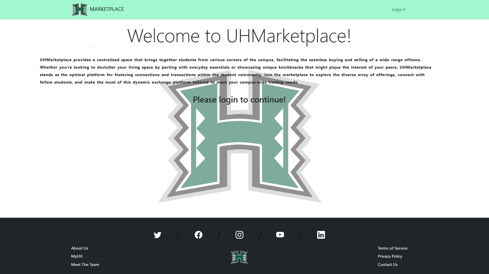

## Facebook but better
The <a href="https://uhmarketplace.com">UHMarketplace</a>, our final project developed in ICS 314 by a team of five, is an online platform designed for the University of Hawaii community. Utilizing Meteor, MongoDB, React, and Bootstrap, our platform provides an efficient and user-friendly experience for buying and selling items. The UHMarketplace serves as a practical application of our coursework, emphasizing entrepreneurship within a structured framework. Employing Meteor for application development, MongoDB for data storage, React for the front end, and Bootstrap for design, the platform provides an open marketplace accessible to all users

## My Contributions

## What I learned
This project marked a significant transformation of meteor-template-react, originally a template for kickstarting Meteor application development. Throughout the process, I gained practical knowledge in Meteor, React, and Bootstrap 5. The journey involved delving into testing methodologies, open-source software development, adhering to coding standards, and successfully deploying the application for a global audience.

On a personal growth note, this project became a lesson in self-directed learning. While I had a foundation in the basics from class, the actual implementation introduced new and occasionally perplexing challenges. This experience underscored the importance of staying proactive in my education, fostering a desire to keep pace with my peers.

## Links
<a href="https://the-manoa-marketplace.github.io/uh-marketplace.github.io/">Homepage</a>, <a href="https://github.com/the-manoa-marketplace/the-real-manoa-marketplace">GitHub</a>,
