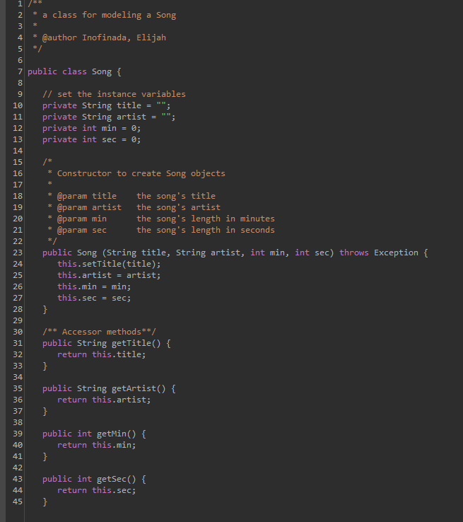
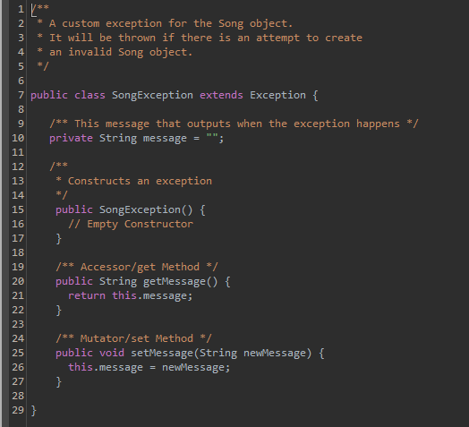

This interactive program serves as a simulation allowing users to add, remove, or save a specified number of songs (X amount) to a playlist, which can be stored in a file. 

Within this program, you'll find a collection of no less than five song objects, each containing valid data. To make these operations smoother, the program uses a set of three personalized methods that work together in harmony. Moreover, the custom exceptions help catch any input errors from users that might be out of the valid range. While it may not rival the features of platforms like Spotify, the program emulates the experience of managing and organizing songs within a playlist.

<div class="text-center p-4">
  
  
</div>

Above, are snippets of the custom exception, and the class designed for modeling the song object.

Here is an example of many outputs the user could be prompted with:

```cpp
Lets listen to some tunes !!
	** Boba **
[
Title: SUNSET BOULEVARD (3: 10) by HOHYUN, 
Title: KISS ME (3: 32) by DPR LIVE, 
Title: Peanut Butter & Tears (3: 44) by DPR IAN, 
Title: airplane thoughts (3: 30) by dhruv, 
Title: War With Heaven (3: 12) by Keshi]
Do you like it? Should I make any changes?
yes
Should I add, or remove a song... or nevermind?
nevermind
Great, I hope you liked it!!
Heres how the playlist looks so far :D!!
[
Title: SUNSET BOULEVARD (3: 10) by HOHYUN, 
Title: KISS ME (3: 32) by DPR LIVE, 
Title: Peanut Butter & Tears (3: 44) by DPR IAN, 
Title: airplane thoughts (3: 30) by dhruv, 
Title: War With Heaven (3: 12) by Keshi]
Did you want to save the playlist so you can listen to it later?
yes
You can save it to a file, type yes or no...
no
You just lost all your songs!
Its okay though, just restart...

Thanks for using my program!! :D

```

